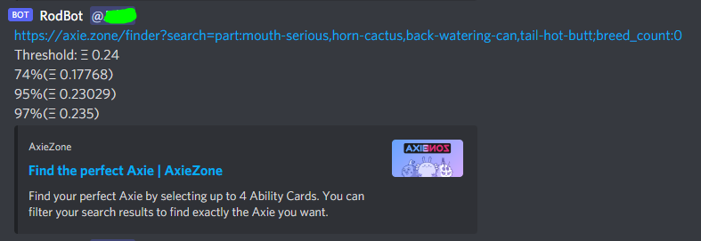

# moneymine

Web scraper/discord bot

Confere o site axie.zone a cada 5 minutos. Se encontra axie a venda por um preço menor do que o definido pelo usuário, o envia uma notificaçõa pelo Discord

# Setup
Criar arquivo pings.txt na raiz com os IDs de quem deve receber as notificações Formato exemplo: <@123456789123456789><@123456789123456790>

Criar arquivo token.txt na raiz com o token do bot que enviará as notificações Formato exemplo: ASdasdASDasdAsdASdasdasd.ASdasd.ASDdasdasdas_Aasddas_dasdaa

Criar arquivo urls.txt na raiz com as urls e limites de preço em ETH separadas por um pipe (url|Ξ), uma por linha
 Formato exemplo: 
https://axie.zone/finder?search=class:aquatic;part:mouth-risky-fish,horn-shoal-star,back-bidens,tail-koi;breed_count:0;purity:3|0.24 
https://axie.zone/finder?search=class:bird;part:mouth-little-owl,horn-eggshell,back-pigeon-post,tail-post-fight;breed_count:0|0.22 
https://axie.zone/finder?search=class:aquatic;part:mouth-piranha,horn-shoal-star,back-sponge,tail-nimo;breed_count:0;purity:3|0.35
